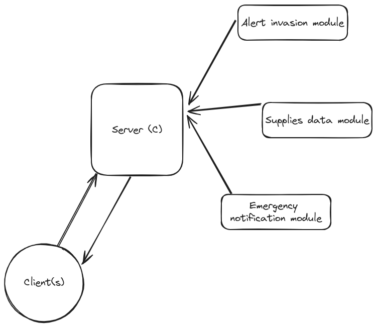

# Development of Monitoring Application for Resistance

## 🎯 Objectives

The primary purpose of this lab is for students to gain practical skills in developing client-server applications using C language, utilizing sockets for interprocess communication. Additionally, it aims to reinforce the understanding and application of an additional interprocess communication mechanism, previously covered in Operating Systems I. The discretionary choice of this mechanism is made to improve efficiency and collaboration, specifically contextualizing its use in an Industry 4.0-related scenario. The post-apocalyptic narrative of "The Last of Us" serves as a contextual framework, providing a motivating and relevant perspective for implementing these concepts in a critical survival environment.

## 📝 Evaluation Aspects

1. **Implementation of Client-Server Architecture:**
   Correct implementation of the client-server architecture using sockets in the C language.

2. **Selection and Application of Additional IPC Mechanism:**
   Effective selection and application of an additional interprocess communication mechanism, supported by a solid rationale and consideration of specific contextual needs.

3. **Thorough Validation and Testing:**
   Rigorous testing to ensure the stability and security of the application.

4. **Clear and Comprehensive Documentation:**
   Preparation of detailed documentation explaining the architecture, functionalities, and procedures for using the application, with a particular emphasis on the role of the implemented additional mechanism.

5. **Demonstrative Presentation:**
   Effective demonstration of the application in operation, highlighting the practical application of Software Engineering concepts in development.


## 📽 🎞 The story begins...

*In the remnants of a once-majestic civilization, humanity grapples with the shadow cast by an unyielding fungal infection. Joel, a leader etched with the scars of both loss and survival, finds himself standing at the pivotal junction of guiding the resistance within an underground sanctuary. Formerly a thriving industrial hub, this refuge now stands as the ultimate stronghold against the metamorphosis of the populace into hostile entities. The control room, transformed into a crucible of uncertainty, serves as the focal point for Joel's vision: a real-time monitoring application, the final beacon of hope for the resistance.*

<p align="center">
  
</p>

You are chosen for this critical mission. Your proficiency in C programming will be the key to creating an application that connects the refuge population with the critical state of the post-apocalyptic environment.

### Application Description:

<p align="center">
  
</p>

#### Clients of the Application:
People connect to the central server to receive a summary of the current state of the refuge in JSON format. The application serves as the window to hope, providing critical data on alerts, supplies, and emergency notifications. As we must preserve the security, each client will require authentication to access the start the application, this information will be the `hostanme` of the running client, as user and password. (For now, we keep this simple, but we will improve this in the future.)

Clients can connect using different devices, such as computers or tablets. The application will be available for the following protocols: TCP and UDP over IPv4 and IPv6.

#### Central Server:
Located in the control room, the central server acts as the communication nexus, sending updated summaries to clients and managing vital refuge information.

### Tasks to Implement:

#### Alerts of possible infection
Implement instant alerts for possible infected refuged. Strategic temperature sensors writes in a log file with the timestamp, the temperature of each person that enters to the refuge. If the temperature is higher than 38°C, the application will send an alert to the central server.

```text
Wed Mar 07 12:27:29 2012, NORT ENTRY,  35.6
Wed Mar 07 12:27:29 2012, EAST ENTRY,  35.6
Wed Mar 07 12:27:29 2012, WEST ENTRY,  35.6
Wed Mar 07 12:27:29 2012, SOUTH ENTRY, 38 //Here! Quarantine!
```

#### Supplies Data
Store data on essential supplies such as food and medicine. The application will provide detailed information for strategic decision-making. The only way to modify this information, if the `ubuntu` client is running (Remember the user is `ubuntu` and the password is `ubuntu`) sends the new information to the server in a JSON format. The server must validate the `hostanme` key to update the information.

```json
{
   "hostname": "hostname",
   "food": {
      "meat": 100,
      "vegetables": 200,
      "fruits": 150,
      "water": 1000
   },
   "medicine": {
      "antibiotics": 50,
      "analgesics": 100,
      "bandages": 100
   }
}

```

#### Emergency Notifications and record
Develop instant emergency notifications. If possible, unfortunately, suffer power outages or other critical situations, the server will close all the connections and send a notification to all connected clients.
The server will keep a log file with all the events that happens in the refuge. This file will be in the `/var/log/` directory, and the name will be `refuge.log`. The file will have the following format:

```text
Wed Mar 07 12:27:29 2012, Connection from new client (IP)
Wed Mar 07 12:27:29 2012, Update of supplies from client (IP) - Authorized
Wed Mar 07 12:27:29 2012, Update of supplies from client (IP) - Denied invalid hostname
Wed Mar 07 12:27:29 2012, Request of state from client (IP)
Wed Mar 07 12:27:29 2012, Alert of possible infection in ENTRY
Wed Mar 07 12:27:29 2012, Server failure. Emergency notification sent to all connected clients.
Wed Mar 07 12:27:29 2012, Connection close from client (IP)
```

#### JSON Format State Summary
Implement a refuge state summary in JSON format, providing population with key information on alerts, supplies, and emergency notifications.

```json
{
   "alerts": {
      {
         "north_entry": 1,
         "east_entry": 1,
         "west_entry": 1,
         "south_entry": 1,
      },
   },
   "supplies": {
      "food": {
         "meat": 100,
         "vegetables": 200,
         "fruits": 150,
         "water": 1000
      },
      "medicine": {
         "antibiotics": 50,
         "analgesics": 100,
         "bandages": 100
      }
   },
   "emergency": {
      "last_keepalived": "Wed Mar 07 12:27:29 2012",
      "last_event": "Server failure/Server shutdown"
   }
}
```

### Key points

Critical functionalities, such as Invasion Alerts, Supplies Data, will be implemented as static libraries, meanwhile Emergency Notifications will be a dynamic library. These libraries will be reusable components for simulating information to be sent to the server.


### Bonus
- Package the client code in RPM and DEB packages for streamlined deployment and distribution.

This lab will challenge your technical expertise as you immerse yourself in a post-apocalyptic world, where every line of code is essential for the survival of the resistance. Your task is the light in the darkness, providing survivors with the necessary tools to face an uncertain future.

### References
[Generate DEB Packages](https://youtu.be/ep88vVfzDAo)

[Generate RPM Packages](https://youtu.be/sNDs6AoNmA8)
