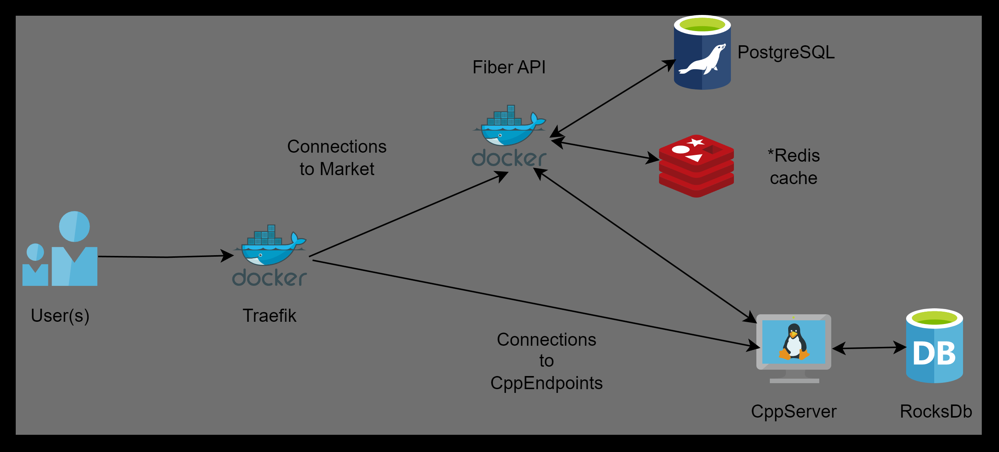

# New World

## 🎯 Objectives
This project aims to develop a robust and secure backend in Golang using the Fiber framework. It will serve as the technological backbone for a survival store that strategically manages and sells surplus supplies to other refugee communities.

## 📝 Evaluation Aspects
- **Code Quality and Architecture**: Implement a clean, well-organized Model-Service-Repository pattern ensuring modularity and maintainability.
- **Functionality**: Robust functionality across all server endpoints for accurate, real-time supply management.
- **Security**: Secure API access with JWT authentication to ensure data integrity and protect against unauthorized access. We are also using TLS as a security layer.
- **Scalability**: The application should be scalable, and designed to handle increasing loads and concurrent users efficiently.
- **Documentation**: Detailed documentation should include setup instructions, API usage examples, and deployment guidelines.

## 📽 🎞 New World
*As Joel and his team of survivors continue their mission to stabilize their world, the real-time monitoring application has become more than just a tool; it's a symbol of revival and human resilience. As they move beyond their underground confines, the survivors use their technological prowess to reach out to other isolated groups, hoping to expand their network and enhance their collective strength.*

*With the application's real-time data, they identify a series of potentially habitable zones unclaimed by the fungal scourge. Plans are swiftly put into motion to explore these areas. Each mission is carefully monitored from the control room, where the team can react instantly to any sign of danger or opportunity, adjusting their strategies based on live environmental data.*

<p align="center">
  
</p>

*With surplus supplies now more abundant thanks to efficient resource management, the survivors initiate trade with nearby communities. They use the application to manage trade logs, monitor resource levels, and schedule deliveries, turning the refuge into a bustling trade hub. This economic activity brings a semblance of normalcy and hope, strengthening community bonds and fostering economic resilience.*

## 🔑 Application Description

<p align="center">
  
</p>

Our backend application will interface with the existing HPCPP project to access and trade the current **20%** of the supply levels. Key components include:

- **Technology Stack**:
  - **Fiber**: Utilized for creating a high-performance HTTP server.
  - **Traefik**: Used as a reverse proxy and load balancer to efficiently manage and route requests.
  - **JWT**: Ensures secure endpoint access, allowing only authenticated users to view the market.
  - **Postgres**: Utilized for robust data storage and management.

- **Endpoints**:

<details>
 <summary><code>POST</code> <code><b>/auth/register</b></code> <code>(Register a new user)</code></summary>

##### Parameters

> | name      |  type     | data type               | example                                                           |
> |-----------|-----------|-------------------------|-----------------------------------------------------------------------|
> | data      |  required | `application/json`   | `{ "username": "john_doe", "email": "john@example.com", "password": "securepassword123" }`  |


##### Responses

> | http code     | content-type                      | response                                                            |
> |---------------|-----------------------------------|---------------------------------------------------------------------|
> | `500`         | `application/json`                | `{"code":"500","message":"Bad server"}`                            |
> | `201`         | `application/json`                | `{"code":"201","message":"User added"} `                           |
> | `400`         | `application/json`                | `{"code":"400","message":"Bad request"}`                           |

##### Example httpie

> ```javascript
>  echo -n '{ "username": "john_doe", "email": "john@example.com", "password": "securepassword123" }' | http POST localhost:3000/auth/register
> ```
</details>

<details>
 <summary><code>POST</code> <code><b>/auth/login</b></code> <code>(Authenticate a user)</code></summary>

##### Parameters

> | name      |  type     | data type               | example                                                           |
> |-----------|-----------|-------------------------|-----------------------------------------------------------------------|
> | data      |  required | `application/json`   | `{ "email": "john@example.com", "password": "securepassword123" }`  |


##### Responses

> | http code     | content-type                      | response                                                            |
> |---------------|-----------------------------------|---------------------------------------------------------------------|
> | `500`         | `application/json`                | `{"code":"500","message":"Bad server"}`                            |
> | `201`         | `application/json`                | `{"code":"200","auth":"JWT"} `                                     |
> | `400`         | `application/json`                | `{"code":"400","message":"Bad request"}`                           |

##### Example httpie

> ```javascript
>  echo -n '{ "email": "john@example.com", "password": "securepassword123" }' | http POST localhost:3000/auth/register
> ```
</details>


<details>
 <summary><code>GET</code> <code><b>/auth/offers</b></code> <code>(Retrieve a list of available offers)</code></summary>

##### Parameters

> | name      |  type     | data type               | example                                                           |
> |-----------|-----------|-------------------------|-----------------------------------------------------------------------|
> | data      |  required | `application/json`   | `securityDefinitions: jwt: type: apiKey name: Authorization in: header`  |


##### Responses

> | http code     | content-type                      | response                                                            |
> |---------------|-----------------------------------|---------------------------------------------------------------------|
> | `500`         | `application/json`                | `{"code":"500","message":"Bad server"}`                            |
> | `200`         | `application/json`                | `{"code":"200",{"message":[{"id":"1","name":"meat","quantity":100,"price":10,"category":"food"},{"id":"2","name":"vegetables","quantity":200,"price":5,"category":"food"},{"id":"3","name":"fruits","quantity":150,"price":8,"category":"food"},{"id":"4","name":"water","quantity":1000,"price":2,"category":"drink"},{"id":"5","name":"antibiotics","quantity":50,"price":15,"category":"medicine"},{"id":"6","name":"analgesics","quantity":100,"price":8,"category":"medicine"},{"id":"7","name":"bandages","quantity":100,"price":5,"category":"medicine"},{"id":"8","name":"pistol ammo","quantity":200,"price":1,"category":"ammo"},{"id":"9","name":"rifle ammo","quantity":300,"price":1.5,"category":"ammo"},{"id":"10","name":"shotgun ammo","quantity":100,"price":2,"category":"ammo"}]}} `                                     |
> | `401`         | `application/json`                | `{"code":"401","message":"Unauthorized"}`                           |

##### Example httpie

> ```javascript
>  http --auth-type=jwt --auth="<token>" GET localhost:3000/auth/offers
> ```
</details>

<details>
 <summary><code>POST</code> <code><b>/auth/checkout</b></code> <code>(Buy a list of orders)</code></summary>

##### Parameters

> | name      |  type     | data type               | example                                                           |
> |-----------|-----------|-------------------------|-----------------------------------------------------------------------|
> | data      |  required | `application/json`   | `{"order":{ "id": 1, items: [{"quantity":10,"product_id":1},{"quantity":5, "product_id":4},{"quantity":3,"product_id":2}]}`  |
> | data      |  required | `application/json`   | `securityDefinitions: jwt: type: apiKey name: Authorization in: header`  |


##### Responses

> | http code     | content-type                      | response                                                            |
> |---------------|-----------------------------------|---------------------------------------------------------------------|
> | `500`         | `application/json`                | `{"code":"500","message":"Bad server"}`                             |
> | `200`         | `application/json`                | `{"code":"200",{"message":{"total":"1000","status":"pending"}`|
> | `401`         | `application/json`                | `{"code":"401","message":"Unauthorized"}`                           |

##### Example httpie

> ```javascript
>  echo -n '{"order":{ "id": 1, items: [{"quantity":10,"product_id":1},{"quantity":5, "product_id":4},{"quantity":3,"product_id":2}]}' | http --auth-type=jwt --auth="<token>" POST localhost:3000/auth/checkout
> ```
</details>

<details>
 <summary><code>GET</code> <code><b>/auth/orders/:id</b></code> <code>(Get the status of a specific order)</code></summary>

##### Parameters

> | name      |  type     | data type               | example                                                           |
> |-----------|-----------|-------------------------|-----------------------------------------------------------------------|
> | data      |  required | `application/json`   | `securityDefinitions: jwt: type: apiKey name: Authorization in: header`  |


##### Responses

> | http code     | content-type                      | response                                                            |
> |---------------|-----------------------------------|---------------------------------------------------------------------|
> | `500`         | `application/json`                | `{"code":"500","message":"Bad server"}`                             |
> | `200`         | `application/json`                | `{"code":"200",{"message":{"status":{ "preparing/processing/shipped/delivered"}`|
> | `401`         | `application/json`                | `{"code":"401","message":"Unauthorized"}`                           |

##### Example httpie

> ```javascript
>  http --auth-type=jwt --auth="<token>" GET localhost:3000/auth/orders/1
> ```
</details>

<details>
 <summary><code>GET</code> <code><b>/admin/dashboard</b></code> <code>(Get status of all market)</code></summary>

##### Parameters

> | name      |  type     | data type               | example                                                           |
> |-----------|-----------|-------------------------|-----------------------------------------------------------------------|
> | data      |  required | `application/json`   | `securityDefinitions: jwt: type: apiKey name: Authorization in: header role: Admin`  |


##### Responses

> | http code     | content-type                      | response                                                            |
> |---------------|-----------------------------------|---------------------------------------------------------------------|
> | `500`         | `application/json`                | `{"code":"500","message":"Bad server"}`                             |
> | `200`         | `application/json`                | `{"code":"200",{"message":{ "offers": [ {"id": "1", "name": "meat", "quantity": 100, "price": 10, "category": "food"}, {"id": "2", "name": "vegetables", "quantity": 200, "price": 5, "category": "food"}, {"id": "3", "name": "fruits", "quantity": 150, "price": 8, "category": "food"}, {"id": "4", "name": "water", "quantity": 1000, "price": 2, "category": "drink"}, {"id": "5", "name": "antibiotics", "quantity": 50, "price": 15, "category": "medicine"}, {"id": "6", "name": "analgesics", "quantity": 100, "price": 8, "category": "medicine"}, {"id": "7", "name": "bandages", "quantity": 100, "price": 5, "category": "medicine"}, {"id": "8", "name": "pistol ammo", "quantity": 200, "price": 1, "category": "ammo"}, {"id": "9", "name": "rifle ammo", "quantity": 300, "price": 1.5, "category": "ammo"}, {"id": "10", "name": "shotgun ammo", "quantity": 100, "price": 2, "category": "ammo"} ], "orders": [ {"id": "1", "status": "pending", "total": 1000}, {"id": "2", "status": "pending", "total": 1000}, {"id": "3", "status": "processing", "total": 1000}, {"id": "4", "status": "shipped", "total": 1000}, {"id": "5", "status": "delivered", "total": 1000} ], "balance": 5000 }`|
> | `401`         | `application/json`                | `{"code":"401","message":"Unauthorized"}`                           |

##### Example httpie

> ```javascript
>  http --auth-type=jwt --auth="<token>" GET localhost:3000/admin/dashboard
> ```
</details>

<details>
 <summary><code>PATCH</code> <code><b>/admin/orders/:id</b></code> <code>(Update the status of a specific order)</code></summary>

##### Parameters

> | name      |  type     | data type               | example                                                           |
> |-----------|-----------|-------------------------|-----------------------------------------------------------------------|
> | data      |  required | `application/json`   | `{"status":{ "preparing/processing/shipped/delivered" }`  |
> | data      |  required | `application/json`   | `securityDefinitions: jwt: type: apiKey name: Authorization in: header role: Admin`  |


##### Responses

> | http code     | content-type                      | response                                                            |
> |---------------|-----------------------------------|---------------------------------------------------------------------|
> | `500`         | `application/json`                | `{"code":"500","message":"Bad server"}`                             |
> | `200`         | `application/json`                | `{"code":"200",{"message":{"status":{ "preparing/processing/shipped/delivered"}`|
> | `401`         | `application/json`                | `{"code":"401","message":"Unauthorized"}`                           |

##### Example httpie

> ```javascript
>  echo -n '{"status":{ "preparing/processing/shipped/delivered"}' | http --auth-type=jwt --auth="<token>" PATCH localhost:3000/auth/orders/1
> ```
</details>

## 📌 Tasks to Implement
- **Initialize Fiber Application**: Set up the project structure and basic server functionalities using the Fiber framework.
- **Implement the Model-Service-Repository Pattern**: Define models for supply data, services for business logic processing, and repositories for database interactions.
- **Secure API with JWT**: Configure JSON Web Tokens for authentication and authorization processes.
- **Traefik Integration**: Set up and configure Traefik as the entry point for the application to handle request routing.

### 〽️ Bonus

- **Dockerization**: Containerize both the Go backend and the React frontend to simplify deployment processes. Use `docker-compose` for easy multi-container orchestration.
- **Frontend Integration**: Ensure that the provided React project interfaces seamlessly with the backend, implementing features for authentication and displaying the supplies data.
- **REDIS Integration**: Ensure seamless integration of REDIS for optimized caching and enhanced data retrieval efficiency. 
- **Add more endpoints**: Improve the APP adding more endpoints.

<details>
 <summary><code>GET</code> <code><b>/admin/users</b></code> <code>(Get all buyers, only for admins)</code></summary>

 ##### Parameters

> | name      |  type     | data type               | example                                                           |
> |-----------|-----------|-------------------------|-----------------------------------------------------------------------|
> | data      |  required | `application/json`   | `securityDefinitions: jwt: type: apiKey name: Authorization in: header role: Admin`  |


##### Responses

> | http code     | content-type                      | response                                                            |
> |---------------|-----------------------------------|---------------------------------------------------------------------|
> | `500`         | `application/json`                | `{"code":"500","message":"Bad server"}`                             |
> | `200`         | `application/json`                | `{"code":"200",{"message":[{ "username": "john_doe", "email": "john@example.com"},...] } `|
> | `401`         | `application/json`                | `{"code":"401","message":"Unauthorized"}`                           |

</details>

<details>
 <summary><code>DELETE</code> <code><b>/admin/users/</b></code> <code>(Remove an customer)</code></summary>

  ##### Parameters

> | name      |  type     | data type               | example                                                           |
> |-----------|-----------|-------------------------|-----------------------------------------------------------------------|
> | data      |  required | `application/json`   | `{"user": [ 1, 5 ] }`  |
> | data      |  required | `application/json`   | `securityDefinitions: jwt: type: apiKey name: Authorization in: header role: Admin`  |


##### Responses

> | http code     | content-type                      | response                                                            |
> |---------------|-----------------------------------|---------------------------------------------------------------------|
> | `500`         | `application/json`                | `{"code":"500","message":"Bad server"}`                             |
> | `200`         | `application/json`                | `{"code":"200",{"message":"success" } `|
> | `401`         | `application/json`                | `{"code":"401","message":"Unauthorized"}`                           |
</details>
